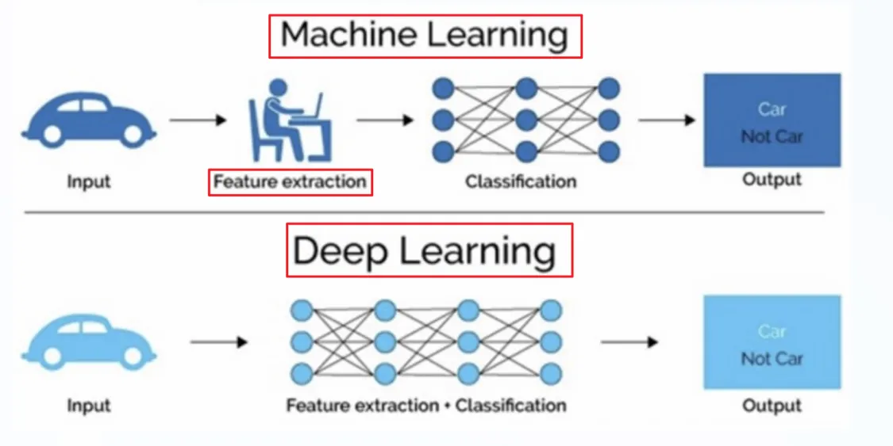

机器学习是实现人工智能的一种途径。
深度学习是机器学习的一个子集，也就是一个具体的方法。

> 人工智能（AI）、机器学习（ML）和深度学习（DL）是密切相关的概念，它们之间的关系可以用一个包含关系来表示：人工智能 > 机器学习 > 深度学习。
>1. 人工智能 (AI)
>人工智能是计算机科学的一个广阔领域，其目标是创造能够执行通常需要人类智能的任务的机器。这些任务包括：
>    * 问题解决： 制定策略和算法来解决复杂问题。
>    * 学习： 从经验中学习并改进性能。
>    * 推理： 使用逻辑和规则得出结论。
>    * 感知： 通过传感器（例如，摄像头、麦克风）感知环境。
>    * 语言理解： 理解和生成人类语言。
>    人工智能是一个非常广泛的概念，它涵盖了许多不同的技术和方法。
>2. 机器学习 (ML)
>机器学习是人工智能的一个子领域。它专注于开发允许计算机无需明确编程即可从数据中学习的算法和技术。换句话说，机器学习算法通过分析大量数据来识别模式、做出预测或做出决策，而无需人工编写具体的规则。
机器学习的常见类型包括：
>    * 监督学习： 使用带有标签的训练数据（即输入和正确的输出）来训练模型。例如，使用图像和对应的标签（例如，“猫”、“狗”）来训练图像分类器。
>    * 无监督学习： 使用没有标签的训练数据来发现数据中的隐藏模式。例如，使用客户购买数据来识别不同的客户群体。
>    * 强化学习： 训练智能体在环境中采取行动，以最大化某种奖励。例如，训练一个游戏AI来赢得比赛。
>3. 深度学习 (DL)
>深度学习是机器学习的一个子集。它使用人工神经网络，特别是具有多个层（因此称为“深度”）的神经网络，来处理和分析数据。这些深层神经网络能够学习非常复杂的模式，并且在图像识别、语音识别和自然语言处理等任务中表现出色。
>**深度学习的关键概念是：**
>    * 神经网络： 受人脑结构启发的计算模型，由相互连接的节点（称为神经元）组成。
>    * 深度神经网络 (DNN)： 具有多个隐藏层的神经网络。这些隐藏层允许网络学习数据的分层表示。
>    * 反向传播： 一种用于训练神经网络的算法，通过调整网络中连接的权重来最小化预测误差。
>**它们之间的关系总结：**
>    * 人工智能是一个总体的概念，涵盖了所有使机器能够模拟人类智能的技术。
>    * 机器学习是实现人工智能的一种方法，它侧重于使机器能够从数据中学习。
>    * 深度学习是机器学习的一个子集，它使用深层神经网络来实现更高级的学习和模式识别。
>**一个简单的类比：**
>想象一下你想制造一辆自动驾驶汽车。
>    * 人工智能 是整个自动驾驶汽车项目的目标，包括感知环境、规划路线、控制车辆等。
>    * 机器学习 是一种方法，用于训练汽车的感知系统，例如通过分析大量图像来识别道路标志和行人。
>    * 深度学习 是一种特定的机器学习技术，用于构建汽车的图像识别系统，它使用深层神经网络来处理图像数据并进行准确的识别。

### 深度学习与机器学习的区别

机器学习需要依赖人工提取特征，而深度学习不需要进行人工特征提取，只需要把神经网络搭建完成。

网络结构的设计就是搭建神经网络的过程。

### 发展历程

重点是Tranformer和chatGPT的出现