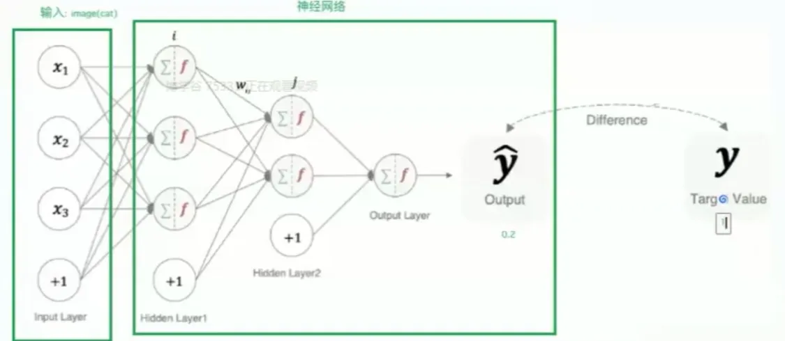

人工神经网络（Artificial Neural Network ，简写：ANN）是模仿生物神经系统（特别是人脑）结构和功能的一种计算模型。它们是深度学习的核心组成部分，赋予了深度学习强大的模式识别和学习能力。


**神经网络的基本结构：**

一个基本的神经网络由以下几个部分组成：

- **神经元（Neuron）：** 也称为节点，是神经网络的基本单元。每个神经元接收输入，进行某种处理，然后产生输出。
- **连接（Connection）：** 神经元之间通过连接相互传递信息。每个连接都有一个权重（Weight），表示连接的强度。权重决定了输入信号对输出的影响程度。
- **层（Layer）：** 神经元按层组织。一个典型的神经网络包括： 

- - **输入层（Input Layer）：** 接收外部输入数据。
  - **隐藏层（Hidden Layer）：** 位于输入层和输出层之间，负责对输入数据进行处理和转换。深度学习中的“深度”就体现在这里，拥有多个隐藏层。
  - **输出层（Output Layer）：** 产生最终的输出结果。

- **特点**：

- - 同一层的神经元之间没有连接。
  - 第N层的每个神经元和第N-1层的所有神经元相连（这就是full connection的含义），也称为全连接神经网络。
  - 第N-1层神经元的输出就是第N层神经元的输入。
  - 每个连接都有一个权重值（w系数和b系数）。

**神经网络的工作原理：**

1. **输入：** 输入数据被传递到输入层的神经元。
2. **加权和：** 每个神经元接收来自上一层神经元的输入，并将这些输入乘以相应的权重进行加权求和。
3. **激活函数：** 将加权和传递给一个激活函数。激活函数引入了非线性，使得神经网络能够学习复杂的模式。常见的激活函数包括Sigmoid、ReLU、Tanh等。
4. **输出：** 激活函数的输出成为该神经元的输出，并传递到下一层神经元。
5. **重复：** 这个过程在网络中逐层进行，直到到达输出层。

**训练神经网络：**

训练神经网络的过程包括以下几个步骤：

1. **前向传播（Forward Propagation）**：将输入数据通过网络各层传递，计算每个神经元的输出，直到产生最终输出。
2. **损失函数（Loss Function）**：计算预测输出和实际标签之间的误差。这种误差称为损失，常见的损失函数有均方误差（MSE）和交叉熵损失（Cross-Entropy Loss）。
3. **反向传播（Backpropagation）**：通过损失函数的梯度计算，反向调整每个神经元的权重，以最小化损失。反向传播算法使用链式法则来高效计算梯度。
4. **优化器（Optimizer）**：使用优化算法（如梯度下降、Adam 等）根据计算出的梯度更新网络权重，从而减小损失。


### 激活函数

加权和在进行输入计算后始终是**线性**的，需要引入激活函数用于对每层的输出数据进行变换，进而为整个网络注入非线性因素，此时神经网络可以拟合出各种曲线，以此来表达复杂问题的解答。

**Pytorch中封装了常见的激活函数**


**sigmoid 激活函数-- 指数型**

`sigmoid`函数一般只用于**二分类**的**输出层**


Sigmoid函数，也称为S型函数或乙状函数，是一种形状像字母“S”的数学函数。它在机器学习，特别是深度学习和逻辑回归中，作为激活函数被广泛使用。

**定义和公式：**

Sigmoid函数最常见的形式是**逻辑斯谛函数**，其公式如下：

σ(x) = 1 / (1 + e<sup>-x</sup>)

其中：

- σ(x) 是函数的输出值。
- x 是函数的输入值（可以是任意实数）。
- e 是自然常数（约等于2.71828）。

**图像和特性：**

Sigmoid函数的图像呈S形，具有以下特性：

- **定义域：** (−∞, +∞) （输入可以是任意实数）
- **值域：** (0, 1) （输出值始终在0和1之间，但不包括0和1）
- **单调递增：** 输入值越大，输出值也越大。
- **连续光滑：** 函数曲线平滑连续，处处可导。
- **在x=0处中心对称：** σ(0) = 0.5。
- **导数：** σ'(x) = σ(x)(1 - σ(x))，导数可以用函数自身来表示，这在反向传播算法中非常有用。

**Sigmoid函数在神经网络中的应用：**

在神经网络中，Sigmoid函数通常作为激活函数使用，其主要作用是引入非线性。如果没有激活函数，神经网络就只能进行线性运算，表达能力非常有限。Sigmoid函数将神经元的加权输入转换为0到1之间的输出，可以看作是神经元“激活”的概率。

**Sigmoid函数的优缺点：**

**优点：**

- **输出范围有限：** 将输出限制在0到1之间，可以方便地表示概率或进行归一化。
- **光滑可导：** 方便进行梯度计算，用于反向传播算法。
- **易于理解和使用：** 函数形式简单，易于实现。

**缺点：**

- **梯度消失：** 当输入值非常大或非常小时，函数的梯度接近于0。这会导致在反向传播过程中，梯度难以传递到前面的层，从而导致网络训练缓慢甚至停滞。这是Sigmoid函数最大的缺点，也是它在深度神经网络中逐渐被其他激活函数（如ReLU）取代的主要原因。
- **输出不是以0为中心：** 输出值始终为正，这可能会导致一些优化问题。
- **计算量较大：** 计算指数运算相对耗时。


**ReLU激活函数-分段型**

`ReLu`函数常用于**隐藏层**


**定义和公式：**

ReLU函数的数学表达式非常简单：

f(x) = max(0, x)

这意味着：

- 当输入x大于0时，输出等于输入本身（f(x) = x）。
- 当输入x小于等于0时，输出为0。

**图像和特性：**

ReLU函数的图像由两条直线组成，在x=0处有一个拐点。其主要特性包括：

- **非线性：** ReLU函数虽然形式简单，但它是一个非线性函数，这使得神经网络能够学习复杂的模式。
- **计算简单：** ReLU函数只需要进行简单的比较和赋值操作，计算速度非常快。
- **单侧抑制：** 当输入小于0时，输出恒为0，这导致一部分神经元处于“非激活”状态，有助于网络的稀疏性表达，减少参数之间的相互依赖，缓解过拟合。
- **不存在梯度消失问题（在正区间）：** 当输入大于0时，梯度恒为1，这使得梯度可以有效地传递到前面的层，避免了梯度消失问题，加快了网络训练速度。

**ReLU函数的优缺点：**

**优点：**

- **缓解梯度消失问题：** 这是ReLU最重要的优点之一，它有效地解决了Sigmoid和tanh等激活函数在输入较大或较小时容易出现的梯度消失问题，使得深度神经网络更容易训练。
- **计算速度快：** 相比于Sigmoid和tanh等需要进行指数运算的激活函数，ReLU的计算速度非常快，这大大加快了网络的训练速度。
- **促进稀疏性：** ReLU的单侧抑制特性使得一部分神经元输出为0，从而产生稀疏的网络结构，有助于减少参数之间的相互依赖，提高模型的泛化能力。

**缺点：**

- **Dead ReLU Problem（神经元死亡问题）：** 如果某个神经元的输入在训练过程中一直为负数，那么该神经元的输出将始终为0，导致该神经元“死亡”，不再对网络的学习起到作用。这通常是由于较大的学习率或不合适的初始化参数导致的。

**ReLU的变体：**

为了解决Dead ReLU Problem，人们提出了一些ReLU的变体，例如：

- **Leaky ReLU（带泄漏的ReLU）：** 将输入小于0的部分赋予一个很小的斜率，而不是直接设为0。例如，f(x) = x (x>0)；f(x) = αx (x<=0)，其中α是一个很小的常数，例如0.01。这避免了神经元完全“死亡”的情况。
- **Parametric ReLU (PReLU，参数化ReLU)：** 将Leaky ReLU中的α作为一个可学习的参数，通过反向传播进行学习。
- **Exponential Linear Unit (ELU，指数线性单元)：** 在输入小于0的部分使用指数函数，而不是简单的线性函数。

**ReLU在神经网络中的应用：**

ReLU及其变体是目前深度学习中最常用的激活函数之一，尤其在卷积神经网络（CNN）中应用广泛。通常来说，ReLU是隐藏层激活函数的首选。


**SoftMax激活函数**

常用于处理**多分类问题**的**输出层**，将多分类结果以**概率**的形式展示。


**定义和公式：**

给定一个包含 n 个实数的向量 z = (z<sub>1</sub>, z<sub>2</sub>, ..., z<sub>n</sub>)，Softmax 函数的定义如下：

Softmax(z)<sub>i</sub> = e<sup>z<sub>i</sub></sup> / Σ<sub>j=1</sub><sup>n</sup> e<sup>z<sub>j</sub></sup>

其中：

- Softmax(z)<sub>i</sub> 表示向量 z 的第 i 个元素的 Softmax 输出。
- e 是自然常数（约等于 2.71828）。
- Σ<sub>j=1</sub><sup>n</sup> e<sup>z<sub>j</sub></sup> 表示对向量 z 的所有元素的指数求和。

**工作原理：**

Softmax 函数首先对输入向量的每个元素取指数，然后将每个元素的指数值除以所有元素指数值的总和。这样就保证了输出向量的每个元素都在 (0, 1) 之间，并且所有元素的总和为 1，从而构成了一个概率分布。

**Softmax 在神经网络中的应用：**

Softmax 函数通常用于神经网络的输出层，尤其是在多分类问题中。例如，在图像分类任务中，神经网络的输出层可以有 10 个神经元，分别对应 10 个不同的类别。经过 Softmax 函数处理后，输出层每个神经元的输出就表示该图像属于对应类别的概率。

**Softmax 的优点：**

- **输出为概率分布：** Softmax 的输出可以直接解释为概率，方便进行分类决策。
- **突出最大值：** Softmax 函数能够突出输入向量中值最大的元素，使得分类结果更加明确。

**Softmax 的缺点：**

- **计算开销：** 需要计算指数和求和，计算开销相对较大。
- **梯度消失（在某些情况下）：** 当输入向量的某些元素值非常大时，可能会导致梯度消失问题。
- **对输入变化敏感：** 输入向量的微小变化可能会导致输出概率的较大变化。

**Softmax 与其他激活函数的比较：**

- **与 Sigmoid 的比较：** Sigmoid 函数通常用于二分类问题，而 Softmax 函数则用于多分类问题。当类别数为 2 时，Softmax 函数退化为 Sigmoid 函数。
- **与 ReLU 的比较：** ReLU 函数主要用于隐藏层，而 Softmax 函数主要用于输出层。ReLU 解决了 Sigmoid 的梯度消失问题，但 Softmax 仍然在多分类输出层占有重要地位。

**总结：**

Softmax 激活函数是一种重要的激活函数，尤其在多分类问题中应用广泛。它将输入向量转换为概率分布，方便进行分类决策。虽然存在一些缺点，但仍然是深度学习中不可或缺的一部分。

**补充说明：**

- 为了数值稳定性，在实际应用中，通常会对 Softmax 函数的计算进行一些改进，例如减去输入向量的最大值。
- Softmax 函数通常与交叉熵损失函数一起使用，以优化神经网络的训练。

**示例：**

假设有一个输入向量 z = [2, 1, 0]，则 Softmax 的计算过程如下：

1. 计算每个元素的指数：

- - e<sup>2</sup> ≈ 7.39
  - e<sup>1</sup> ≈ 2.72
  - e<sup>0</sup> = 1

1. 计算所有元素指数值的总和：

- - 7.39 + 2.72 + 1 = 11.11

1. 计算每个元素的 Softmax 输出：

- - Softmax(z)<sub>1</sub> = 7.39 / 11.11 ≈ 0.665
  - Softmax(z)<sub>2</sub> = 2.72 / 11.11 ≈ 0.245
  - Softmax(z)<sub>3</sub> = 1 / 11.11 ≈ 0.090

因此，Softmax(z) ≈ [0.665, 0.245, 0.090]。可以看到，这三个数的和接近于 1，并且每个数都在 0 到 1 之间。


**激活函数的选择方法**
对于隐藏层：

1. 优先选择`ReLU`激活函数
2. 如果`relu`效果不好，那么尝试其他激活，如`leaky ReLU`等。
3. 如果你使用了ReLU,需要注意一下`dead ReLU`问题，避免出现大的梯度从而导致过多的神经元死亡。

对于输出层：

1. 二分类问题选择`sigmoid`激活函数
2. 多分类问题选择`SoftMax`激活函数


**其他常见的激活函数**


### 损失函数

什么是损失函数

用来**衡量模型参数质量**的**函数**，衡量的方式是比较神经网络输出和真实输出的差异，**损失函数告诉我们模型“犯了多大的错误”。通过最小化损失函数，我们可以优化模型的参数，使其预测结果更接近真实值。**例如：输入一张猫的照片，看输出的结果，





**损失函数的作用：**

1. **指导模型训练：** 在训练过程中，优化算法（如梯度下降）会根据损失函数的梯度来调整模型参数，从而使损失函数的值不断减小。
2. **评估模型性能：** 在训练完成后，我们可以使用损失函数来评估模型在测试集上的表现，从而了解模型的泛化能力。

**常见的损失函数：**

损失函数可以根据任务类型进行分类，主要分为以下两类：

- **回归问题损失函数：** 用于预测连续值的任务。
- **分类问题损失函数：** 用于预测离散类别的任务。


分类问题损失函数

**交叉熵损失（Cross-Entropy Loss）：** 常用于多分类问题。  

在多分类任务通常使用softmax将logits转换为概率的形式


H(p, q) = - Σp(x)log(q(x))

其中，p(x) 是真实概率分布，q(x) 是预测概率分布。

- **优点：** 能够有效地衡量两个概率分布之间的差异，优化效果好。


**损失函数与激活函数的关系：**

损失函数和激活函数是深度学习模型中两个重要的组成部分，它们之间存在一定的联系。例如，在多分类问题中，通常使用 Softmax 激活函数将输出转换为概率分布，然后使用交叉熵损失函数来衡量预测结果与真实结果之间的差异。


### 网络优化方法

梯度下降算法是一种用于**寻找损失函数最小值**的优化算法


**核心思想：**

想象你站在一座山上，想要下到山谷。梯度下降法就像你在山上寻找最陡峭的下坡路，然后沿着这个方向走一步，重复这个过程，直到到达山谷的最低点。

**数学原理：**

- **梯度：** 在数学中，梯度是一个向量，它指向函数值增长最快的方向。因此，梯度的反方向就是函数值下降最快的方向。
- **迭代：** 梯度下降法通过不断迭代来逼近最小值。每次迭代，它都会沿着梯度的反方向移动一小步。

**公式：**

θ<sub>new</sub> = θ<sub>old</sub> - α * ∇J(θ)

其中：

- θ<sub>new</sub>：更新后的参数值。
- θ<sub>old</sub>：当前的参数值。
- α：学习率（learning rate），控制每次迭代的步长。
- ∇J(θ)：损失函数 J(θ) 关于参数 θ 的梯度。

**步骤：**

1. **初始化参数：** 随机初始化模型的参数 θ。
2. **计算梯度：** 计算损失函数 J(θ) 关于参数 θ 的梯度 ∇J(θ)。
3. **更新参数：** 使用上述公式更新参数 θ。
4. **重复步骤 2 和 3：** 直到损失函数的值收敛到一个可接受的范围内，或者达到预定的迭代次数。

**不同类型的梯度下降：**

根据每次迭代使用的样本数量，梯度下降法可以分为以下几种类型：

- **批量梯度下降（Batch Gradient Descent, BGD）：** 每次迭代使用所有训练样本来计算梯度。

- - **优点：** 能够保证收敛到全局最小值（对于凸函数），训练过程相对稳定。
  - **缺点：** 计算量大，训练速度慢，不适合处理大规模数据集。

- **随机梯度下降（Stochastic Gradient Descent, SGD）：** 每次迭代只使用一个随机选择的训练样本来计算梯度。

- - **优点：** 计算速度快，适合处理大规模数据集，有可能跳出局部最小值。
  - **缺点：** 训练过程波动较大，不容易收敛到全局最小值。

- **小批量梯度下降（Mini-batch Gradient Descent, MBGD）：** 每次迭代使用一小部分随机选择的训练样本（称为一个 mini-batch）来计算梯度。

- - **优点：** 结合了 BGD 和 SGD 的优点，既能保证一定的稳定性，又能加快训练速度。
  - **缺点：** 需要选择合适的 mini-batch 大小。

**学习率的选择：**

学习率 α 是梯度下降法中一个重要的超参数，它控制了每次迭代的步长。

- **学习率过大：** 可能导致算法在最小值附近震荡，无法收敛。
- **学习率过小：** 可能导致收敛速度过慢。

通常需要通过实验来选择合适的学习率。常用的方法包括：

- **试错法：** 尝试不同的学习率，观察训练效果。
- **学习率衰减：** 随着训练的进行，逐渐减小学习率。

**总结：**

梯度下降法是一种简单而有效的优化算法，在机器学习和深度学习中有着广泛的应用。理解其基本原理、不同类型以及学习率的选择对于有效地使用梯度下降法至关重要。

**补充说明：**

除了基本的梯度下降法，还有许多改进的优化算法，例如：

- **动量法（Momentum）：** 引入动量来加速收敛，并减少震荡。
- **Adam 优化器：** 结合了动量法和 RMSProp 的优点，是一种常用的自适应优化算法。

这些改进的优化算法通常能够更快地收敛到最小值，并且对学习率的选择不那么敏感。


### 前向传播和反向传播

前向传播 传参正向计算的过程

反向传播 参数优化的过程，调整权重参数weight，先从深层开始，逐步到浅层。


**前向传播和反向传播视频教程**



```
训练效果由传入的训练量决定，越大越好

假设100000张图片->共15g大小

batch_size 128 表示一次传入的最大参数128张（越大越好）

iter 表示完成一次（128张图片）前向传播和反向传播的**迭代**过程

epoch  表示全部数据（100000张图片）完成一次**轮次**训练
```