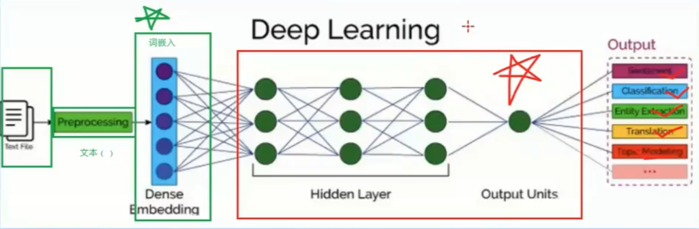
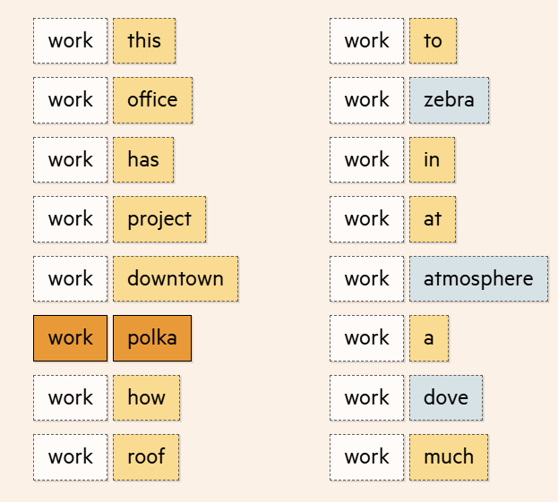
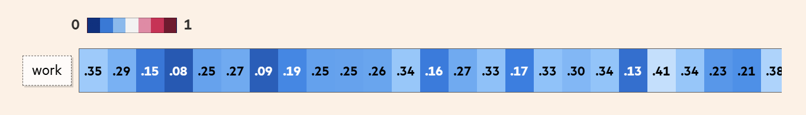
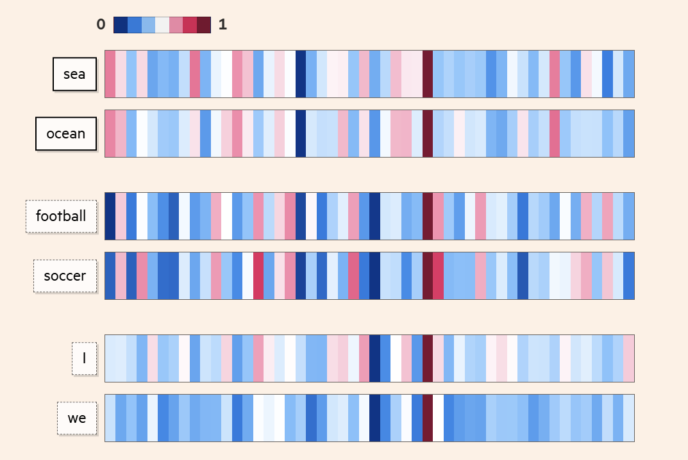
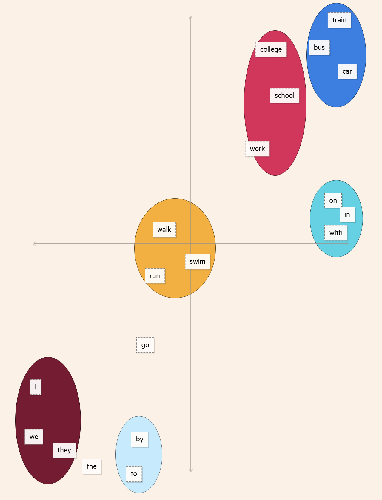
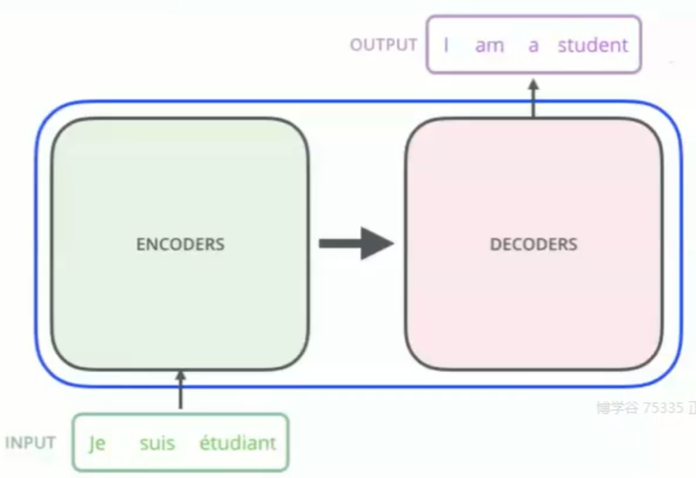
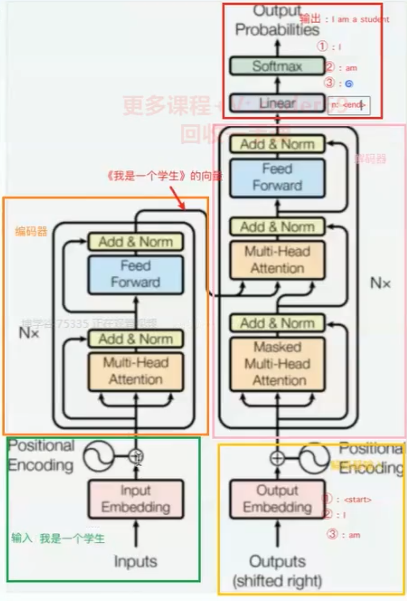
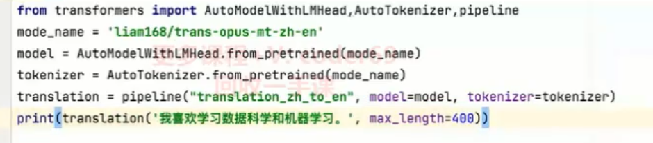

自然语言处理（NLP）是一门融合了计算机科学、人工智能和语言学的交叉学科，旨在让计算机能够理解、解释和生成人类的自然语言。自然语言是指日常使用的语言，如汉语和英语，它比编程语言更复杂多样。
NLP的**目标是使机器能够像人一样理解和使用语言，以实现更自然高效的人机交互。这包括文本信息提取、自动翻译、情感分析、语音识别和问答系统等应用**。例如，NLP可以用来开发聊天机器人和翻译软件。
为了实现这些目标，研究人员使用大量数据集和先进算法，如循环神经网络（RNN）、长短时记忆网络（LSTM）和变换器（Transformer）。这些技术的进步显著提升了NLP系统的性能，在许多任务上达到了接近甚至超过人类的水平。

 > 一个典型的 NLP 流程大致分为以下几个步骤：
>
> 1. **输入 (Text File)：** NLP 过程的起始点，通常是文本文件，例如文章、对话、网页等。
>
> - 这是 NLP 系统的原始数据，例如一段文字：“今天天气真好，适合出去玩。”
>
> 1. **预处理 (Preprocessing)：** 对原始文本进行清洗和规范化，为后续处理做准备。
>
> - **目的**： 清理和规范化文本，去除噪声，使模型更容易学习。
> - **常用方法：**
>
> - - **分词 (Tokenization)：** 将文本分解成独立的词语或子词。例如，将“今天天气真好” 分成 “今天”，“天气”，“真”，“好”。
>   - **去除停用词 (Stop Word Removal)：** 去除常用的、没有实际意义的词语，例如“的”，“是”，“了”等。
>   - **词干提取 (Stemming) / 词形还原 (Lemmatization)：** 将词语还原为原型，例如将“running” 还原为 “run”。
>   - **大小写转换 (Lowercasing)：** 将所有字母转换为小写，避免大小写带来的差异。
>   - **标点符号去除 (Punctuation Removal)：** 去除文本中的标点符号。
>
> - **例子：** 经过预处理后，“今天天气真好，适合出去玩。” 可能变为 ["今天", "天气", "真", "好", "适合", "出去玩"]。
>
> 1. **词嵌入 (Dense Embedding)：** 将文本转换为计算机可以理解的数值表示形式。**一个分词的词嵌入里有好几百个值**
>
> - **目的：** 将词语转换为计算机可以理解的数值向量。
> - **原理：** 每个词语都被映射到一个高维空间中的向量，向量之间的距离反映了词语之间的语义相似度。
> - **常用方法：**
>
> - - **Word2Vec：** 一种经典的词嵌入方法，通过训练神经网络来学习词向量。
>   - **GloVe：** 一种基于词语共现统计的词嵌入方法。
>   - **FastText：** 一种改进的词嵌入方法，可以处理未登录词。
>
> - **例子：** “今天” 可能被表示为 [0.1, 0.2, -0.3, 0.5 ...], “天气” 可能被表示为 [0.2, 0.3, -0.1, 0.4 ...]。
> - **图中 “Dense Embedding” 下面的蓝色圆点就代表了词向量。**
> - **词嵌入层的作用类似于查字典，将文字转换为计算机可以处理的数字，同时保留了词语的语义信息。**
>
> 1. **深度学习 (Deep Learning)：** 使用深度神经网络来学习文本的特征和模式。
>
> - **目的：** 利用神经网络来学习文本的深层特征和模式。
> - **常用模型：**
>
> - - **循环神经网络 (RNN)：** 适用于处理序列数据，如文本。
>   - **长短期记忆网络 (LSTM)：** 改进的 RNN，可以更好地处理长距离依赖关系。
>   - **Transformer：** 基于自注意力机制的模型，在很多 NLP 任务上都取得了SOTA效果。
>
> - **图中 “Hidden Layer” 代表了神经网络的隐藏层，它负责学习输入数据的复杂特征。**
> - **“Output Units” 代表了神经网络的输出层，它根据任务的需求输出不同的结果。**
>
> 1. **输出 (Output)：** 根据不同的任务，输出相应的结果，例如情感分析、文本分类、实体识别、机器翻译等。
>
> - **目的：** 根据不同的 NLP 任务，输出相应的结果。
> - **常见任务：**
>
> - - **情感分析 (Sentiment)：** 判断文本的情感倾向，例如“积极”、“消极”、“中性”。
>   - **文本分类 (Classification)：** 将文本归类到预定义的类别中。
>   - **实体识别 (Entity Extraction)：** 识别文本中的命名实体，例如人名、地名、组织机构名。
>   - **机器翻译 (Translation)：** 将一种语言的文本翻译成另一种语言。
>   - **主题建模 (Topic Modeling)：** 从文本中提取主题。

**词嵌入扩展**

处理分词，模型会生成一个包含多个值的向量（或者说一列数值），并根据每个单词与 work 在训练数据中的距离调整这些值。这个向量就是所谓的词嵌入（Word Embedding）。

词嵌入里有好几百个值，每个值都代表了单词意义的不同方面。就好比我们用类型、位置、卧室数、浴室数和楼层数来描述房子一样，词嵌入里的值描述了单词的语言特性。

由于我们无法准确知道每个值代表什么，有意思的是，我们发现那些意思相近的单词，它们的词嵌入往往很像。比如 **sea** 和 **ocean**，虽然它们不能在所有情境下互换，但它们的意思很接近，通过词嵌入，我们能量化这种相似度。

如果我们简化词嵌入，只用两个值来表示，就能更直观地看到单词之间的“距离”或者说相似度了。这样，我们就能发现一些词群，比如 **代词**群， **交通工具**群。而能量化单词，正是让模型成功生成文本的第一步。

接下来学习最富盛名的自然语言框架：Transformer模型，也就是隐藏层和输出层的内容。

### Transformer模型

Transformer 模型的核心思想是使用**自注意力机制（Self-Attention Mechanism）**来捕捉输入序列中不同位置之间的关系，而不是像 RNN 那样按顺序处理。自注意力机制允许模型同时关注输入序列中的所有位置，从而更好地捕捉长距离依赖关系。

Transformer的内部，在本质上是一个 encoder-decoder的结构，即编码器-解码器

Transformer工作流程

> **1. 整体结构：**
>
> 1. **输入 (Inputs)：** 模型的原始输入，例如文本序列。
> 2. **输入嵌入 (Input Embedding)：** 将输入的词语转换为词向量表示。
> 3. **位置编码 (Positional Encoding)：** 为词向量添加位置信息，以表示词语在序列中的顺序。
> 4. **编码器 (Encoder)：** 负责处理输入序列，提取文本的语义信息。
> 5. **解码器 (Decoder)：** 负责根据编码器的输出，生成目标序列。
> 6. **输出 (Outputs)：** 模型的最终输出，例如翻译后的文本，或者分类结果。
> 7. **输出概率 (Output Probabilities)：** 对输出进行概率化处理，以便进行概率预测。
>
> **2. 具体步骤详解：**
>
> - **输入 (Inputs)：**
>
> - - 图中显示输入为 “我 是 一个 学生”，这可以是任何文本序列，例如一句话、一篇文章等。
>
> - **输入嵌入 (Input Embedding)：**
>
> - - **目的：** 将输入的词语转换为计算机可以处理的数值向量，即词向量。
>   - **过程：** 每个词语通过一个嵌入层（Embedding Layer）映射到一个高维向量空间，例如，“我” 可能被表示为 [0.1, 0.2, -0.3, 0.5 ...]。
>   - **图中， “Input Embedding” 模块负责完成这个转换。**
>
> - **位置编码 (Positional Encoding)：**
>
> - - **目的：** 由于 Transformer 模型没有 RNN 的顺序处理机制，需要额外的位置编码来表示词语在句子中的位置信息。
>   - **过程：** 位置编码通过一个特定的函数生成，并与词向量相加，从而将位置信息融入到词向量中。
>   - **图中， “Positional Encoding” 模块负责生成位置编码，并与词向量相加。**
>
> - **编码器 (Encoder)：**
>
> - - **目的：** 提取输入序列的语义信息。
>   - **结构：** 由 Nx 个相同的编码器层堆叠而成（图中显示 Nx）。每一层编码器包含：
>
> - - - **多头注意力层 (Multi-Head Attention)：** 这是 Transformer 模型的核心，它使用自注意力机制来计算输入序列中不同位置之间的关系。
>     - **前馈神经网络 (Feed Forward)：** 对每个位置的输出进行非线性变换。
>     - **加和 & 归一化 (Add & Norm)：** 使用残差连接和层归一化来稳定训练过程，加速收敛。
>
> - - **图中，橙色框代表编码器，它接收经过位置编码的输入，并通过多层注意力机制和前馈网络提取特征。**
>   - **编码器的输出是包含了输入序列语义信息的向量表示。**
>
> - **解码器 (Decoder)：**
>
> - - **目的：** 根据编码器的输出，生成目标序列。
>   - **结构：** 由 Nx 个相同的解码器层堆叠而成（图中显示 Nx）。每一层解码器包含：
>
> - - - **掩码多头注意力层 (Masked Multi-Head Attention)：** 与编码器的多头注意力层类似，但只关注解码器当前位置之前的信息，避免信息泄露。
>     - **多头注意力层 (Multi-Head Attention)：** 计算解码器当前位置与编码器输出之间的注意力权重，用于将编码器的信息融入到解码器中。
>     - **前馈神经网络 (Feed Forward)：** 与编码器中的前馈网络类似。
>     - **加和 & 归一化 (Add & Norm)：** 与编码器中的残差连接和层归一化类似。
>
> - - **图中，粉色框代表解码器，它接收编码器的输出，并通过多层注意力机制和前馈网络生成目标序列。**
>   - **解码器是自回归的，它逐词生成目标序列。**
>
> - **输出嵌入 (Output Embedding)：**
>
> - - **目的：** 将目标序列的词语转换为词向量。
>   - **过程：** 与输入嵌入类似，每个目标词语通过一个嵌入层映射到一个高维向量空间。
>   - **图中，“Output Embedding” 模块负责目标词语的向量化。**
>   - **在训练过程中，解码器的输入是目标序列，但向右移动一位，第一个输入是起始符** `**<start>**`**，最后一个输入是结束符** `**<end>**`**。**
>
> - **线性层 (Linear)：**
>
> - - **目的：** 将解码器的输出转换为与词汇表大小相同的向量，用于计算每个词语的概率。
>   - **过程：** 通过一个线性变换，将解码器的输出映射到一个词汇表大小的空间。
>
> - **Softmax：**
>
> - - **目的：** 将线性层的输出转换为概率分布，用于预测下一个词语。
>   - **过程：** Softmax 函数将线性层的输出转换为一个概率分布，每个位置的值表示该位置是词汇表中某个词语的概率。
>
> - **输出概率 (Output Probabilities)：**
>
> - - **目的：** 表示模型预测的下一个词语的概率分布。
>   - **图中，输出显示了生成目标序列 “i am a student” 的过程，每个词语都对应一个概率分布。**
>   - **例如，第一个输出 “i” 的概率最高，第二个输出 “am” 的概率最高，以此类推。**

